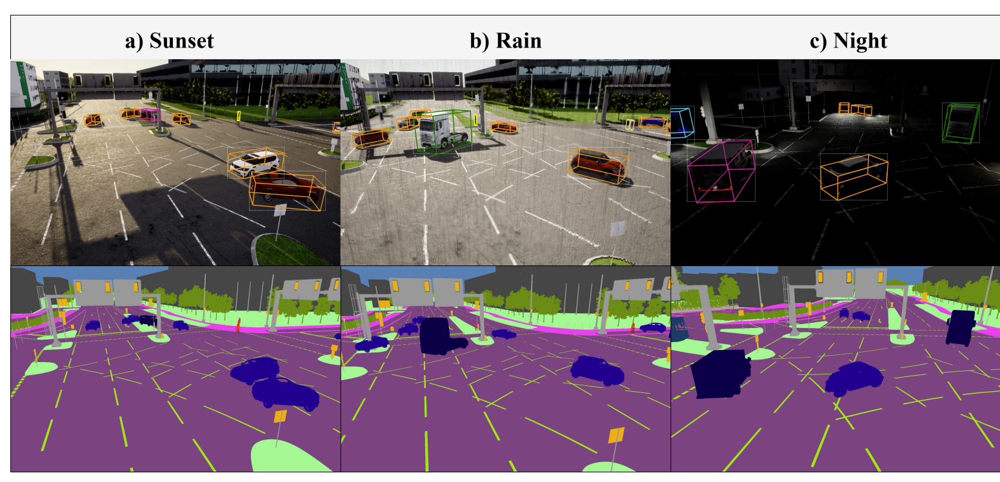
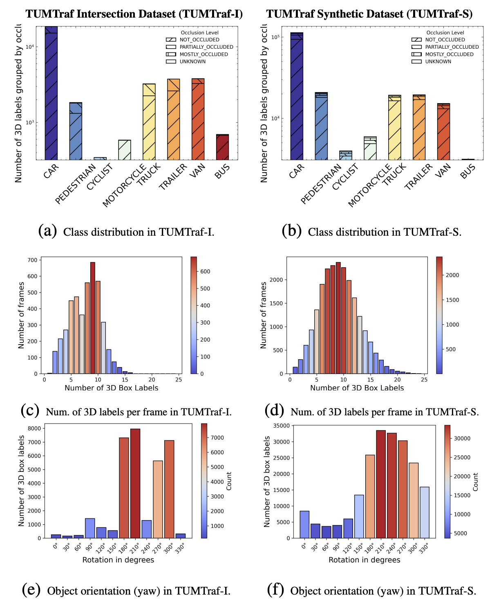
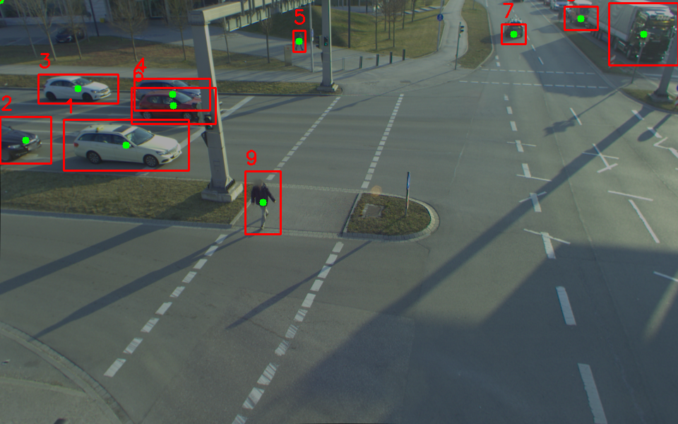
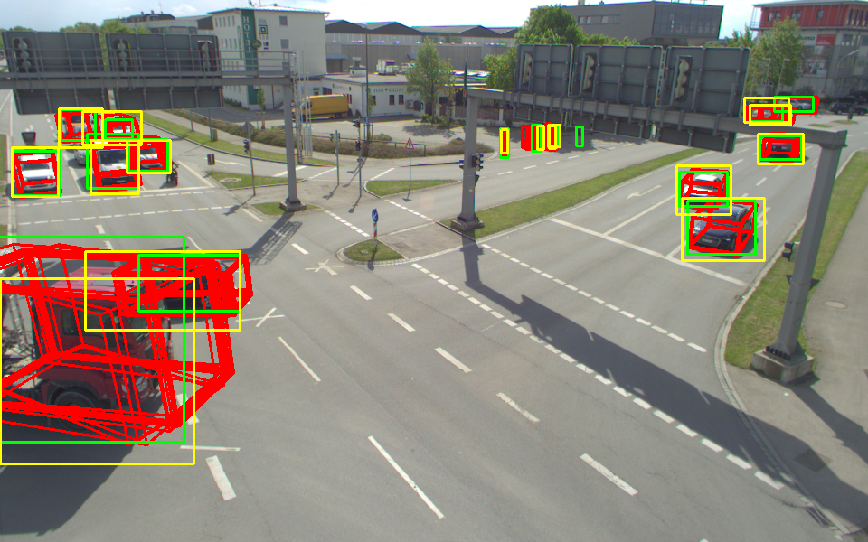
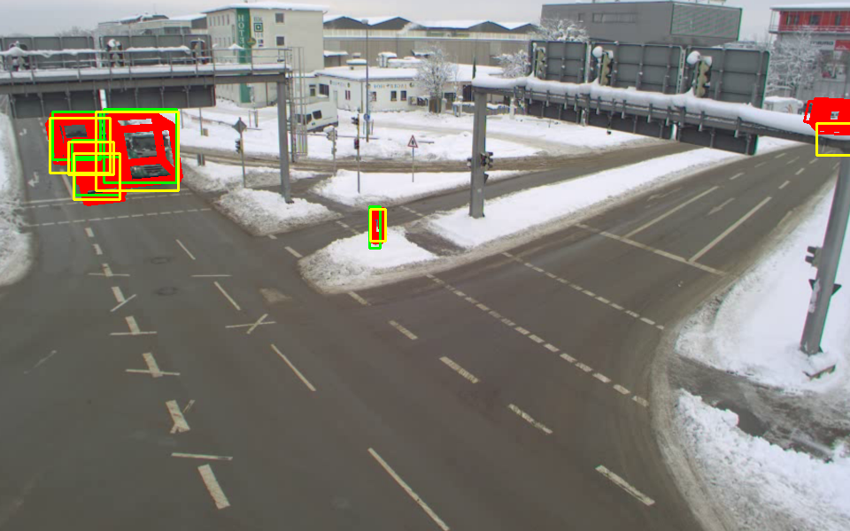
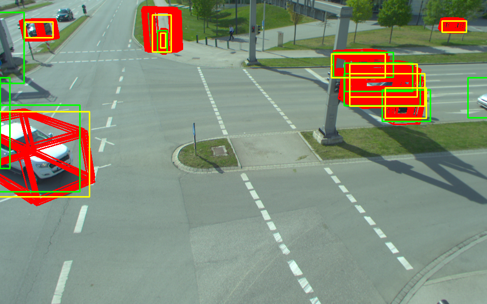

# 🚗 WARM-3D: Weakly-supervised Adaptive Representation for Monocular 3D Object Detection

This repository contains the official implementation of our paper "WARM-3D: Weakly-supervised Adaptive Representation for Monocular 3D Object Detection" (https://ieeexplore.ieee.org/document/10919929).

## 📝 Introduction

WARM-3D is a novel approach for monocular 3D object detection that leverages weakly-supervised learning to improve performance. Our method introduces adaptive representation learning to better capture 3D object properties from monocular images.

<div align="center">
  
  <br>
  <em>Overview of TUMTraffic Synthetic Dataset</em>
</div>

## 📊 Main Results

[Your results will be added here]

## 🛠️ Installation

1. Clone this repository:
```bash
git clone https://github.com/WARM-3D/WARM-3D.git
cd WARM-3D
```

2. Create and activate a conda environment:
```bash
conda create -n warm3d python=3.8
conda activate warm3d
```

3. Install PyTorch and dependencies:
```bash
pip install -r requirements.txt
```

## 📥 Data Preparation

1. Download the TUMTraf A9 Highway Dataset:
   - Visit [TUMTraf Dataset Registration Page](https://a9-dataset.innovation-mobility.com/register)
   - Register and download the dataset
   - TUMTraffic Synthetic (for training) 🎮
   - TUMTraffic Intersection (for evaluation) 🚦
   - For more information about the dataset, visit [TUMTraf Dataset Page](https://innovation-mobility.com/en/project-providentia/a9-dataset/)

<div align="center">
  
  <br>
  <em>Distribution of TUMTraffic Synthetic Dataset</em>
</div>

## 🚀 Training & Ecvaluation

1. Train and evaluation on TUMTraffic dataset:
```bash
bash MonoDETR/train.bash MonoDETR/configs/monodetr.yaml
```

<div align="center">
<table>
<tr>
<td>
  
  <br>
  <em>2D Pseudo Label Generation</em>
</td>
</tr>
<tr>
<td>
  
  <br>
  <em> Matching Process 1 </em>
</td>
<td>
  
  <br>
  <em> Matching Process 2</em>
</td>
<td>
  
  <br>
  <em> Matching Process 3</em>
</td>
</tr>
</table>
</div>

## 🔍 Detect

1. Evaluate on test set:
```bash
bash MonoDETR/test.bash MonoDETR/configs/monodetr_detect.yaml
```

## 📚 Citation

If you find this work useful for your research, please cite our paper:

```bibtex
@INPROCEEDINGS{warm3d-tumtraffic-synthetic,
  author={Zhou, Xingcheng and Fu, Deyu and Zimmer, Walter and Liu, Mingyu and Lakshminarasimhan, Venkatnarayanan and Strand, Leah and Knoll, Alois C.},
  booktitle={2024 IEEE 27th International Conference on Intelligent Transportation Systems (ITSC)}, 
  title={WARM-3D: A Weakly-Supervised Sim2Real Domain Adaptation Framework for Roadside Monocular 3D Object Detection}, 
  year={2024},
  volume={},
  number={},
  pages={3489-3496},
  keywords={Three-dimensional displays;Weak supervision;Detectors;Object detection;Intelligent transportation systems;Synthetic data},
  doi={10.1109/ITSC58415.2024.10919929}}
```

## 🙏 Acknowledgments

This work is built upon the excellent [MonoDETR](https://github.com/ZrrSkywalker/MonoDETR) codebase. We thank the authors for their great work and for making their code publicly available. Please also cite their paper if you use our code:

```bibtex
@article{zhang2022monodetr,
  title={MonoDETR: Depth-guided Transformer for Monocular 3D Object Detection},
  author={Zhang, Renrui and Qiu, Han and Wang, Tai and Xu, Xuanzhuo and Guo, Ziyu and Qiao, Yu and Gao, Peng and Li, Hongsheng},
  journal={ICCV 2023},
  year={2022}
}
```

## 📧 Contact

For any questions, please feel free to contact [Your Contact Information].
